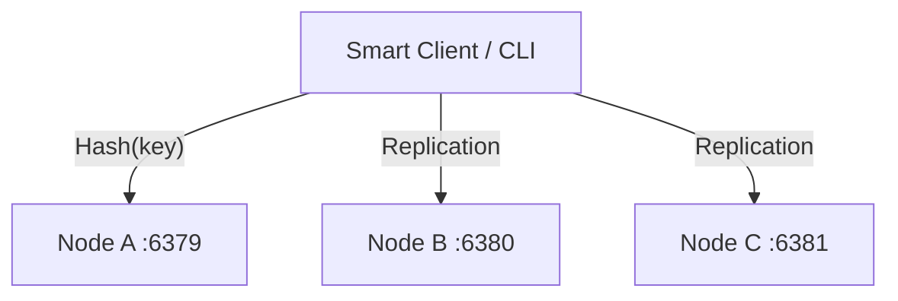

# Project 3: Distributed Cache System

A Redis-like distributed cache built from scratch in TypeScript. It supports TCP networking, consistent hashing, replication, and automatic failover.

## Features
*   **Core:** TCP Server with custom text protocol (`SET`, `GET`, `PING`).
*   **Storage:** In-memory LRU Cache with TTL support.
*   **Distribution:** Consistent Hashing (using virtual nodes) to distribute keys across the cluster.
*   **Reliability:** Replication Factor N=3 with Read Repair.
*   **Ops:** Health monitoring and Admin CLI.

## Architecture
The system consists of 3 independent nodes. A "Smart Client" (CLI) handles the routing logic, determining which node holds the data using Consistent Hashing.


## Performance Benchmarks

This cache system has been benchmarked in two key areas: Eviction and Resilience.

## Eviction
LRU (Least Recently Used) algorithm performs well with recency-heavy workloads, achieving a 75%       
hit rate. However, it struggles with large scans, dropping down to a 29% hit rate. For more
details, please refer to the [Eviction Report](Report_Eviction.md).

## Resilience
In a 3-node cluster, the system demonstrated impressive resilience. Upon killing one node, only       
1/3 of keys failed to be retrieved, resulting in an 88% availability rate. No client-side retry       
logic was utilized during this test. For further information, please consult the [Resilience 
Report](Report_Resilience.md).

## How to Run

To get started with the cache system, follow these steps:

1. Navigate to the cache directory:
```bash
cd 03-cache
```
2. Start the cluster using `docker-compose`:
```bash
docker-compose up
```
3. Open a new terminal to interact with the cluster. You can use the Admin CLI provided:

   - Set a value (Client automatically routes to correct node):
     ```bash
     npx ts-node 03-cache/src/cli.ts SET user:100 "Naveen"
     ```
   - Get a value:
     ```bash
     npx ts-node 03-cache/src/cli.ts GET user:100
     ```