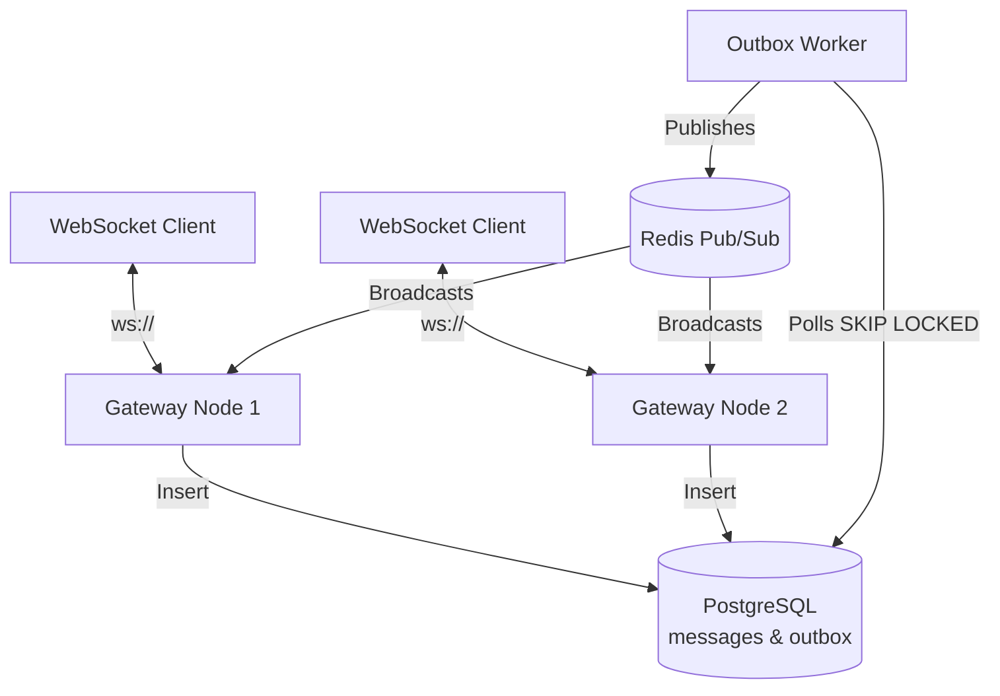

# Project 4: Real-Time Chat System

## Overview
A scalable, distributed real-time chat architecture built with Node.js, WebSockets, Redis, and PostgreSQL.      
It implements the Transactional Outbox Pattern for guaranteed message delivery, Redis Pub/Sub for fan-out,      
and features client-side resilience mechanisms for disaster recovery.

## Architecture Diagram

## Core Components
1. WebSocket Gateway: Handles HTTP upgrades, JWT authentication, and tracks user presence. To protect
server CPU and memory under heavy load, it uses a 100ms message batching strategy and a backpressure 
policy that drops older messages if a slow client's buffer exceeds 100 messages.
2. Message Store & Outbox: Uses PostgreSQL as the source of truth. A background worker constantly polls the outbox table using FOR UPDATE SKIP LOCKED to safely grab pending messages without locking other concurrent workers.
3. Redis Fan-out: The background worker publishes messages to Redis, which instantly broadcasts them to all connected Gateway nodes across the cluster.
4. Client Resilience: Client connections are equipped with exponential backoff and jitter. This scatters reconnection attempts randomly (up to 5 seconds + 200ms jitter) to prevent a "thundering herd" DDoS attack against our own servers during a datacenter recovery.

## Performance Benchmarks
A load test simulating 2,000 concurrent WebSocket clients receiving 20 messages per second yielded the
following delivery latencies on a Windows environment:
• Min: 14-15 ms
• p50 (Median): ~64 ms
• p95: ~111 ms
• p99: ~112 ms
The tight grouping between the p95 and p99 latencies proves that the 100ms batching interval successfully kept the CPU stable and prevented long-tail latency spikes during fan-out.