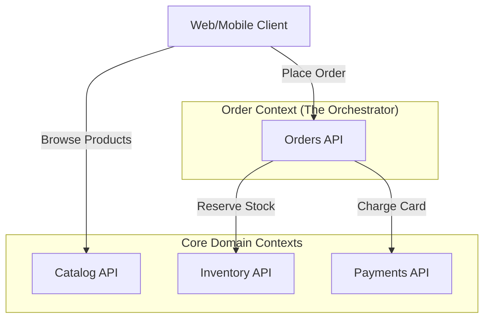

# E-Commerce Domain Boundaries

```mermaid
graph TD
    Client[Web/Mobile Client]

    subgraph "Order Context (The Orchestrator)"
        Orders[Orders API]
    end

    subgraph "Core Domain Contexts"
        Catalog[Catalog API]
        Inventory[Inventory API]
        Payments[Payments API]
    end

    Client -->|Browse Products| Catalog
    Client -->|Place Order| Orders
    
    Orders -->| Reserve Stock| Inventory
    Orders -->| Charge Card| Payments
```