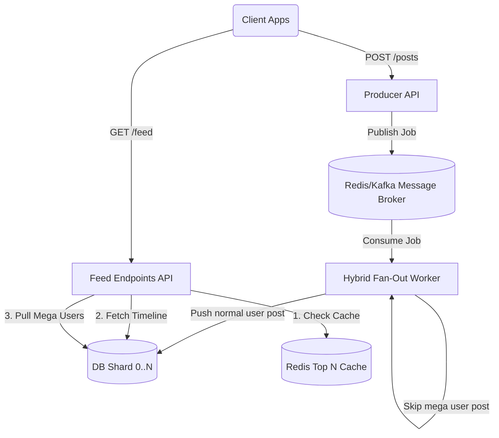

# Project 6: Social Feed Service

## Overview
A scalable, highly available social feed architecture designed to solve the "Celebrity Problem." It handles massive fan-out loads by routing standard users through a push-based worker pipeline, while forcing mega users (celebrities) into a pull-based model.

## Architecture Diagram

## Core Features & Architectural Decisions

### ADR-032: Graph Modeling Choice
Defined our data structure for follower/following relationships using Postgres adjacency lists for strong consistency and operational simplicity over a dedicated Graph DB.

### ADR-033: Hybrid Fan-Out Policy & Sharding
Normal users (< 100k followers) use a "Push" (fan-out on write) model. Mega users (>= 100k followers) use a "Pull" (fan-out on read) model to prevent queue blockages. The database is partitioned using a userId modulo N strategy to distribute the load evenly.

### ADR-034: Outage Recovery & Idempotency
Implemented a robust backfill strategy using cursor replay and database-level duplicate suppression (`INSERT ... ON CONFLICT DO NOTHING`) to ensure identical posts are never added to a timeline during a broker outage recovery.

## Ranking & Keyset Pagination
Feed feeds are dynamically scored based on recency + interactions using a time-decay algorithm. The top results are cached in Redis, and feeds are served via fast cursor-based pagination (keyset pagination) rather than slow OFFSET/LIMIT queries.

## Observability & Load Testing

### Simulated Load
Handled 10,000 publishers pushing to 1,000,000 followers with a measured p99 fan-out latency of ~24ms.

### Dashboards
Integrated Grafana templates to monitor the p95 read latency across all database shards and track the Redis Top N cache hit rate.

## How to Run Locally

1. Ensure Docker is running.
2. Run `docker-compose up --build`.
3. The Producer API will be available on port 3000 and the Feed Endpoints on port 3001.
