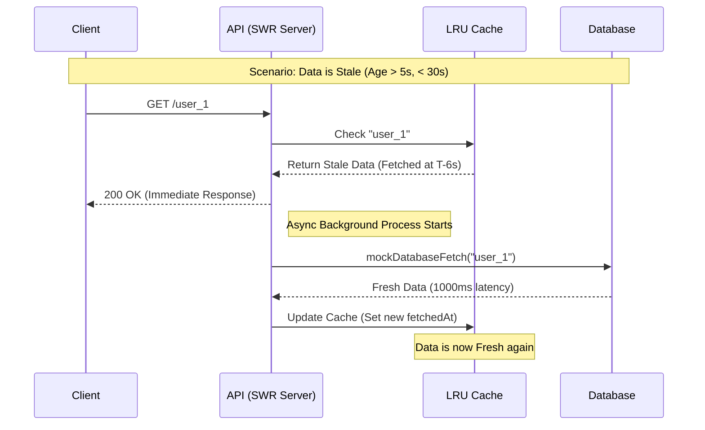

# Stale-While-Revalidate (SWR) Design

## Overview

SWR is an advanced caching pattern designed to eliminate the cache miss penalty for frequently accessed data. It allows the system to serve potentially stale data immediately while asynchronously refreshing the cache in the background.

## Request Lifecycle Comparison

On Day 2, we established a standard request lifecycle where a cache miss or expiration forces the user to wait for a synchronous database fetch. SWR introduces a "Stale" state to decouple user response time from database latency.

### SWR Sequence Diagram

## Implementation Results

Based on the execution of `shared/examples/swr-server.ts`, we observed the following states:

1. **First Request (Miss)**: Synchronous fetch from database with full DB latency.
2. **Immediate Second Request (Fresh Hit)**: Data within `FRESH_TTL` (5s) returns from cache with sub-millisecond latency.
3. **Requesting Stale Data (SWR Triggered)**: After 6 seconds, data older than `FRESH_TTL` but younger than `STALE_LIMIT`:
   - User receives old timestamp immediately
   - Background revalidation logs `[SWR] Revalidating...`
4. **Final Request (Post-Refresh)**: Updated timestamp returned from cache after background task completes.

## Performance Impact

- **Latency**: SWR reduces p99 latency for expired items from ~1000ms (DB speed) to <1ms (Cache speed) within the `STALE_LIMIT` window.
- **Consistency**: Prioritizes Availability over Strong Consistency, adhering to AP-leaning choices in ADR-002.
